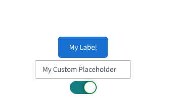

# BBB UI Components React

This repository contains a library of reusable React components extracted from the main [**BigBlueButton (BBB)**](https://github.com/bigbluebutton/bigbluebutton) project. These components provide a consistent and customizable interface that can be reused in other projects, allowing them to easily adopt the BBB visual identity.



## Installation

This library is under active development and has not yet been published on npm. For now, you can clone the repository and install it locally.

### Building the bundle

```
npm install
npm run build-bundle
```

### Using npm link

When developing and testing locally with `npm link`, you may need to adjust your Webpack configuration to ensure compatibility with `styled-components` and `react`, which do not handle multiple instances well. Add the following alias configuration to the project that uses this library:

```json
resolve: {
  alias: {
    'styled-components': path.resolve('./node_modules/styled-components'),
    react: path.resolve('./node_modules/react'),
    'react-dom': path.resolve('./node_modules/react-dom'),
  },
}
```

## Available Components

Below is a list of the components available in this library. Each component has its own detailed documentation with usage examples and a complete list of props.

- [BBBAccordion](./src/components/Accordion/README.md)
- [BBButton](./src/components/Button/README.md)
- [BBBCheckbox](./src/components/Checkbox/README.md)
- [BBBDivider](./src/components/Divider/README.md)
- [BBBHint](./src/components/Hint/README.md)
- [BBBSelect](./src/components/Select/README.md)
- [BBBTextAreaInput](./src/components/TextAreaInput/README.md)
- [BBBTextInput](./src/components/TextInput/README.md)
- [BBBToggle](./src/components/Toggle/README.md)
- [BBBTypography](./src/components/Typography/README.md)
