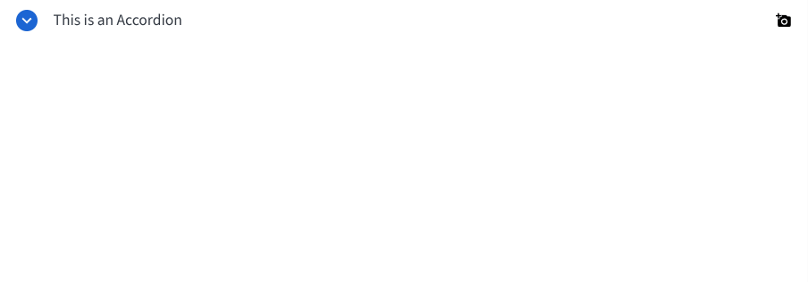

# BBAccordion

The `BBAccordion` component allows you to create collapsible sections of content. It's useful for showing and hiding information in a compact way.



## Usage Example

### Basic Accordion

```jsx
import { BBAccordion } from 'bbb-ui-components-react';

<BBAccordion title="Click to expand">
  <p>This is the content of the accordion.</p>
  <p>It can contain any React nodes.</p>
</BBAccordion>
```

### Accordion with Tooltip

```jsx
import { BBAccordion } from 'bbb-ui-components';

<BBAccordion title="Hover for tooltip" tooltipLabel="This is a helpful tooltip!">
  <p>Content for the accordion with a tooltip.</p>
</BBAccordion>
```

### Accordion with custom button header

```jsx
import { BBAccordion } from 'bbb-ui-components';
import { MdFavorite } from "react-icons/md";

<BBAccordion title="Hover for tooltip" tooltipLabel="This is a helpful tooltip!" buttonHeader={<MdFavorite>}>
  <p>Content for the accordion with a tooltip.</p>
</BBAccordion>
```

## Props

| Property           | Type                                   | Default     | Description                                                                    |
| ------------------ | -------------------------------------- | ----------- | ------------------------------------------------------------------------------ |
| `title`            | `string`                               |             | The text to be displayed in the accordion header.                              |
| `tooltipLabel`     | `string`                               | `null`      | An optional label for the tooltip that appears on hover.                       |
| `tooltipPlacement` | `import('@tippyjs/react').Placement`   | `'bottom'`  | The placement of the tooltip.                                                  |
| `ariaLabel`        | `string`                               |             | The accessible name for the expand button.                                     |
| `ariaLabelledBy`   | `string`                               |             | The ID of the element that labels the expand button.                           |
| `ariaDescribedBy`  | `string`                               |             | The ID of the element that describes the expand button.                        |
| `buttonHeader`     | `React.ReactNode`                      | `null`      | Optional content to be rendered inside the button header.                      |
| `children`         | `React.ReactNode`                      |             | The content to be displayed when the accordion is expanded.                    |
