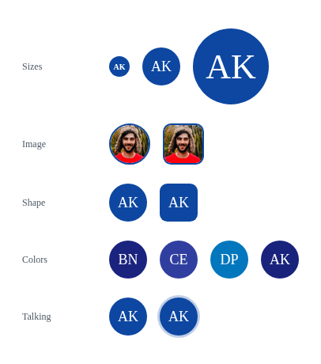

# BBBAvatar

The `BBBAvatar` component renders a user's avatar image, falling back to their initials on a deterministically-colored background when no image is available or the image fails to load. It shows a tooltip with the full name on hover, and can highlight the current user or a speaking user, matching BBB's own avatar treatment.



## Usage Example

### Avatar with image
```jsx
import { BBBAvatar } from 'bbb-ui-components-react';

<BBBAvatar name="Arthur Kaminski" avatarUrl={user.avatar} />
```

### Avatar with initials fallback
```jsx
import { BBBAvatar } from 'bbb-ui-components-react';

<BBBAvatar name="Arthur Kaminski" />
```

### Avatar with a custom color
```jsx
import { BBBAvatar } from 'bbb-ui-components-react';

<BBBAvatar name="Arthur Kaminski" color="#0F70D7" />
```

### Medium avatar
```jsx
import { BBBAvatar } from 'bbb-ui-components-react';

<BBBAvatar name="Arthur Kaminski" size="medium" />
```

### Large avatar
```jsx
import { BBBAvatar } from 'bbb-ui-components-react';

<BBBAvatar name="Arthur Kaminski" size="large" />
```

### Moderator avatar
```jsx
import { BBBAvatar } from 'bbb-ui-components-react';

<BBBAvatar name="Arthur Kaminski" isModerator />
```

### Current user's avatar
```jsx
import { BBBAvatar } from 'bbb-ui-components-react';

<BBBAvatar name="Arthur Kaminski" isYou />
```

### Talking indicator
```jsx
import { BBBAvatar } from 'bbb-ui-components-react';

<BBBAvatar name="Arthur Kaminski" isTalking />
```

### Avatar without the hover tooltip
```jsx
import { BBBAvatar } from 'bbb-ui-components-react';

<BBBAvatar name="Arthur Kaminski" disableTooltip />
```

## Props

| Property         | Type                 | Default                                     | Description                                                                                                                   |
| ---------------- | -------------------- | -------------------------------------------- | ------------------------------------------------------------------------------------------------------------------------------- |
| `name`           | `string`             |                                              | Full name of the user; used to render initials, to derive a deterministic fallback color, and as the tooltip content.          |
| `avatarUrl`      | `string`             |                                              | URL of the user's avatar image. Falls back to initials when omitted or if the image fails to load.                            |
| `color`          | `string`             | color deterministically derived from `name` | Background color behind the initials (and border color on the image). Overrides `isYou`.                                     |
| `size`           | `'small' \| 'medium' \| 'large'` | `'medium'`                        | Size variant of the avatar.                                                                                                     |
| `isModerator`    | `boolean`            | `false`                                      | Renders a rounded-square shape instead of a circle, matching BBB's moderator avatar treatment.                                |
| `isYou`          | `boolean`            | `false`                                      | Marks this avatar as belonging to the current user, applying BBB's "you" color in place of the fallback/computed color. Ignored when `color` is set. |
| `isTalking`      | `boolean`            | `false`                                      | Shows a pulsing ring around the avatar, in its own color, matching BBB's talking indicator.                                    |
| `disableTooltip` | `boolean`            | `false`                                      | Disables the tooltip that shows the full `name` on hover.                                                                      |
