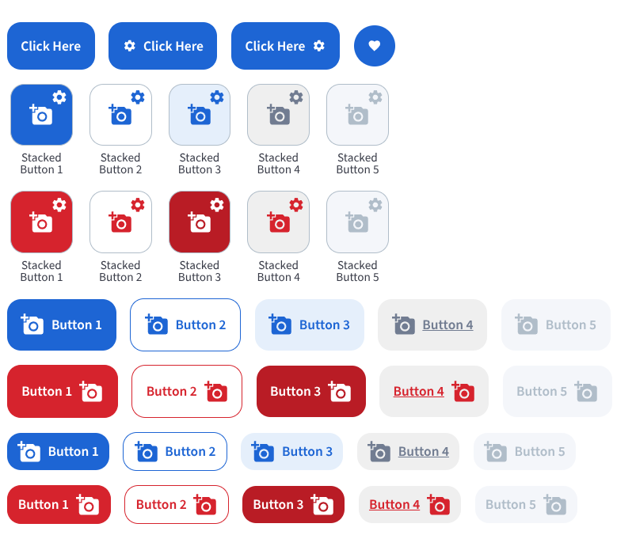

# BBButton

The `BBButton` component is a versatile button that supports multiple layouts and styles. It can be rendered as a standard inline button, a circular icon button, or a stacked button with an icon and a label.



## Usage Examples

### Standard Button

```jsx
import { BBButton } from 'bbb-ui-components-react';

<BBButton label="Click Here" onClick={() => (console.log('clicked'))}/>
```

### Standard Button with Icon Before or After the label

```jsx
import { BBButton } from 'bbb-ui-components-react';
import { MdSettings } from 'react-icons/md';

<BBButton label="Click Here" iconStart={<MdSettings />} onClick={() => (console.log('clicked'))}/>
<BBButton label="Click Here" iconEnd={<MdSettings />} onClick={() => (console.log('clicked'))}/>
```

### Circular Button

```jsx
import { BBButton } from 'bbb-ui-components-react';
import { MdFavorite } from 'react-icons/md';

<BBButton layout="circle" icon={<MdFavorite />} tooltipLabel="Favorite" onClick={() => (console.log('clicked'))}/>
```

### Stacked Button

```jsx
import { BBButton } from 'bbb-ui-components-react';
import { MdPlayArrow } from 'react-icons/md';

<BBButton layout="stacked" icon={<MdPlayArrow size={30} />} label="Settings" onClick={() => (console.log('clicked'))}/>
```

## Props

| Property           | Type                                                              | Default           | Description                                                              |
| ------------------ | ----------------------------------------------------------------- | ----------------- | ---------------------------------------------------------------------- |
| `id`               | `string`                                                          | `''`              | The unique identifier for the button.                                  |
| `dataTest`         | `string`                                                          |                   | The 'data-test' attribute for testing purposes.                        |
| `label`            | `string`                                                          |                   | The text to be displayed on the button.                                |
| `tooltipLabel`     | `string`                                                          |                   | The text to be displayed in a tooltip on hover.                        |
| `tooltipPlacement` | `keyof typeof TOOLTIP_PLACEMENTS`                                 | `'top'`           | The placement of the tooltip.                                          |
| `onClick`          | `() => void`                                                      |                   | The function to be called when the button is clicked.                  |
| `onKeyDown`        | `(event: React.KeyboardEvent<HTMLButtonElement>) => void`         |                   | The function to be called when a key is pressed.                       |
| `ariaLabel`        | `string`                                                          | `''`              | The ARIA label for accessibility.                                      |
| `ariaLabelledBy`   | `string`                                                          | `''`              | The ARIA `aria-labelledby` for accessibility.                          |
| `ariaDescribedBy`  | `string`                                                          | `''`              | The ARIA `aria-describedby` for accessibility.                         |
| `color`            | `keyof typeof COLORS`                                             | `'primary'`       | The color of the button.                                               |
| `variant`          | `keyof typeof VARIANTS`                                           | `'primary'`       | The variant of the button.                                             |
| `size`             | `keyof typeof SIZES`                                              | `'medium'`        | The size of the button.                                                |
| `layout`           | `keyof typeof LAYOUTS`                                            | `'default'`       | The layout of the button.                                              |
| `disabled`         | `boolean`                                                         | `false`           | If `true`, the button will be disabled.                                |
| `children`         | `React.ReactNode`                                                 |                   | The content of the button, typically used for the 'default' layout.    |
| `icon`             | `React.ReactNode`                                                 |                   | The icon to be displayed. Used for 'circle' and 'stacked' layouts.     |
| `iconStart`        | `React.ReactNode`                                                 |                   | The icon to be displayed at the start of the button. Used for 'default' layout.|
| `iconEnd`          | `React.ReactNode`                                                 |                   | The icon to be displayed at the end of the button. Used for 'default' layout. |
| `helperIcon`       | `React.ReactNode`                                                 |                   | The auxiliary icon to be displayed. Used for 'stacked' layout.         |
| `hideHelperIcon`   | `boolean`                                                         | `false`           | If `true`, the auxiliary icon will be hidden. Used for 'stacked' layout.|
| `helperOnClick`    | `(event: React.MouseEvent<HTMLDivElement>) => void`               |                   | The function to be called when the auxiliary icon is clicked.          |
