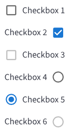

# BBBCheckbox

The `BBBCheckbox` component is a customizable checkbox that wraps the Material-UI Checkbox and provides additional features, such as custom layouts and a round variant.



## Usage Example

```jsx
import { BBBCheckbox } from 'bbb-ui-components';

<BBBCheckbox label="I accept the terms" />
```

### Round Checkbox

```jsx
import { BBBCheckbox } from 'bbb-ui-components';

<BBBCheckbox label="Round Selection" round />
```

## Props

| Property   | Type                   | Default   | Description                                                                 |
| ---------- | ---------------------- | --------- | --------------------------------------------------------------------------- |
| `label`    | `string`               |           | The text to be displayed as the label for the checkbox.                     |
| `layout`   | `keyof typeof LAYOUTS` | `'right'` | The position of the label relative to the checkbox.                         |
| `round`      | `boolean`              | `false`   | If `true`, the checkbox will be rendered as a round radio-style button.     |
| `ariaLabel`| `string`               |           | The accessible name for the checkbox.                                       |
| `...props` | `any`                  |           | Any other props will be passed down to the underlying Material-UI Checkbox component. |
