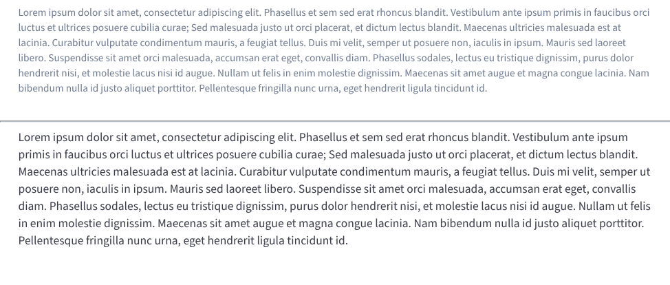

# BBBDivider

The `BBBDivider` component is a simple horizontal line used to separate content.



## Usage Example

```jsx
import { BBBDivider } from 'bbb-ui-components-react';

<div>
  <span>Content above</span>
  <BBBDivider />
  <span>Content below</span>
</div>
```

## Props

This component does not receive any props.
