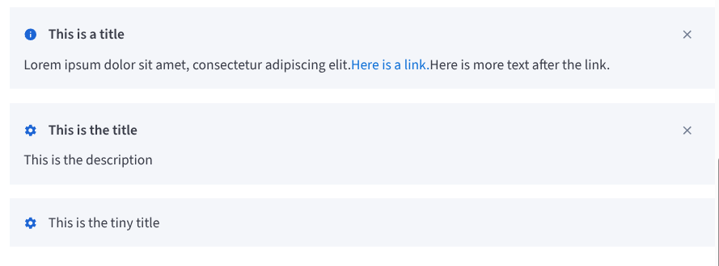

# BBHint

The `BBHint` component is used to display informational messages to the user. It can be used to show tips, warnings, or other important information.



## Usage Example

### Basic Hint

```jsx
import { BBHint } from 'bbb-ui-components';

<BBHint label="This is a simple hint." />
```

### Hint with Title and Close Button

```jsx
import { BBHint } from 'bbb-ui-components';

<BBHint
  title="Information"
  label="This hint has a title and a close button."
  onRequestClose={() => alert('Hint closed!')}
/>
```

## Props

| Property         | Type                             | Default | Description                                                                          |
| ---------------- | -------------------------------- | ------- | ------------------------------------------------------------------------------------ |
| `label`          | `string`                         |         | The main text content of the hint.                                                   |
| `title`          | `string`                         |         | An optional title for the hint. If provided, a close button will be displayed.       |
| `icon`           | `React.ReactNode`                |         | An optional icon to be displayed next to the title or label.                         |
| `onRequestClose` | `() => void`                     |         | A callback function to be called when the close button is clicked.                   |
| `children`       | `React.ReactNode`                |         | Optional additional content to be displayed below the label.                         |
| `...props`       | `HTMLAttributes<HTMLDivElement>` |         | Any other props will be passed down to the underlying container div.                 |
