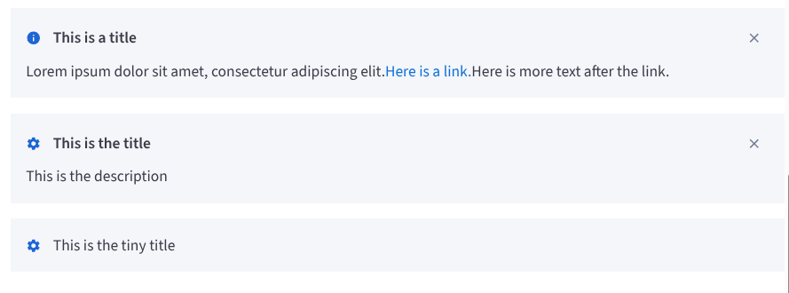

# BBBHint

The `BBBHint` component is used to display informational messages to the user. It can be used to show tips, warnings, or other important information.



## Usage Example

### Basic Hint

```jsx
import { BBBHint } from 'bbb-ui-components-react';

<BBBHint label="This is a simple hint." />
```

### Hint with Title and Close Button

```jsx
import { BBBHint } from 'bbb-ui-components-react';

<BBBHint
  title="Information"
  label="This hint has a title and a close button."
  onRequestClose={() => alert('Hint closed!')}
/>
```

### Uncontrolled Hint (default)

Without an `open` prop, the hint manages its own visibility and closes itself when the close button is clicked — no external state required.

```jsx
import { BBBHint } from 'bbb-ui-components-react';

<BBBHint label="This is a simple hint." />
```

### Controlled Hint

Pass `open` to drive visibility externally; the hint calls `onRequestClose` instead of hiding itself, leaving the parent in charge of updating `open`.

```jsx
import { useState } from 'react';
import { BBBHint } from 'bbb-ui-components-react';

const [open, setOpen] = useState(true);

<BBBHint
  open={open}
  onRequestClose={() => setOpen(false)}
  label="This hint's visibility is controlled externally."
/>
```

### Hint Without a Close Button

Pass `hideCloseButton` for hints that shouldn't be manually dismissed — e.g. ones dismissed by interacting with another UI element, or tooltip-style hints with no explicit dismiss action.

```jsx
import { BBBHint } from 'bbb-ui-components-react';

<BBBHint hideCloseButton label="This hint cannot be manually dismissed." />
```

## Props

| Property          | Type                             | Default | Description                                                                          |
| ----------------- | -------------------------------- | ------- | ------------------------------------------------------------------------------------ |
| `label`           | `string`                         |         | The main text content of the hint.                                                   |
| `title`           | `string`                         |         | An optional title shown in the header; when set, `label` renders as a separate line below instead of inline. |
| `icon`            | `React.ReactNode`                |         | An optional icon to be displayed next to the title or label.                         |
| `open`            | `boolean`                        |         | Whether the hint is visible. Omit to let the hint manage its own visibility, closing itself when the close button is clicked; pass a boolean to control visibility externally. |
| `onRequestClose`  | `() => void`                     |         | A callback function to be called when the close button is clicked, in both controlled and uncontrolled mode. |
| `hideCloseButton` | `boolean`                        | `false` | Hides the close (X) button, for hints that shouldn't be manually dismissed.          |
| `children`        | `React.ReactNode`                |         | Optional additional content to be displayed below the label.                         |
| `...props`        | `HTMLAttributes<HTMLDivElement>` |         | Any other props will be passed down to the underlying container div.                 |
