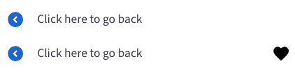

# BBBNavigation

The `BBBNavigation` component provides a customizable button with an icon and a label, suitable for navigation actions within an application.



## Usage Example

### Basic BBBNavigation Button
```jsx
import { BBBNavigation } from 'bbb-ui-components-react';

<BBBNavigation label="Home" onClick={() => console.log('Navigate to Home')} />
```

### BBBNavigation Button with Custom Icon
```jsx
import { BBBNavigation } from 'bbb-ui-components-react';
import { FaHome, MdFavorite } from 'react-icons/fa';

<BBBNavigation label="Home" icon={<FaHome />} onClick={() => console.log('Navigate to Home')} />
```

### BBBNavigation Button with Children
```jsx
import { BBBNavigation } from 'bbb-ui-components-react';
import { MdFavorite } from 'react-icons/fa';

<BBBNavigation label="Settings" onClick={() => console.log('Toggle Settings')}>
  <MdFavorite />
</BBBNavigation>
```

## Props

| Property          | Type                                     | Default | Description                                                                                                |
| ----------------- | ---------------------------------------- | ------- | ---------------------------------------------------------------------------------------------------------- |
| `label`           | `string`                                 |         | The text to be displayed as the label for the navigation button.                                           |
| `onClick`         | `React.MouseEventHandler<HTMLButtonElement>` |         | The function to be called when the navigation button is clicked.                                           |
| `onKeyDown`       | `React.KeyboardEventHandler<HTMLButtonElement>` |         | The function to be called when a key is pressed down on the navigation button.                             |
| `icon`            | `React.ReactNode`                        |         | A custom icon to be displayed. If not provided, a default icon is used.                                    |
| `children`        | `React.ReactNode`                        |         | The children to be rendered inside the navigation button, typically used for sub-menus or other content.   |
| `ariaLabel`       | `string`                                 |         | The accessible name for the navigation button.                                                             |
| `ariaLabelledBy`  | `string`                                 |         | The ID of the element that labels the navigation button.                                                   |
| `ariaDescribedBy` | `string`                                 |         | The ID of the element that describes the navigation button.                                                |
| `dataTest`      | `string`                                 |         | The test ID for the navigation button, used for testing purposes.                                          |
