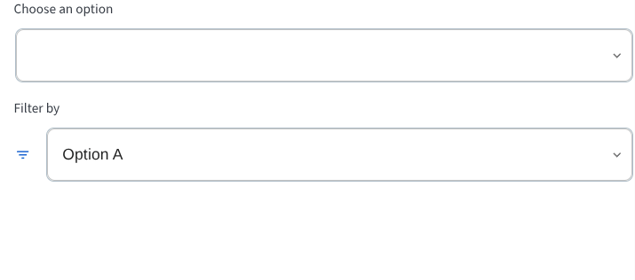

# BBBSelect

The `BBBSelect` component is a customizable select input that wraps the Material-UI Select component, providing additional styling and features.



## Usage Example

### Basic Select

```jsx
import { BBBSelect } from 'bbb-ui-components';
import MenuItem from '@mui/material/MenuItem';

<BBBSelect title="Choose an option" defaultValue="">
  <MenuItem value="">
    <em>None</em>
  </MenuItem>
  <MenuItem value={10}>Ten</MenuItem>
  <MenuItem value={20}>Twenty</MenuItem>
  <MenuItem value={30}>Thirty</MenuItem>
</BBBSelect>
```

### Select with Icon

```jsx
import { BBBSelect } from 'bbb-ui-components';
import MenuItem from '@mui/material/MenuItem';
import { MdFilterList } from 'react-icons/md';

<BBBSelect title="Filter by" icon={<MdFilterList />} defaultValue={10}>
  <MenuItem value={10}>Option A</MenuItem>
  <MenuItem value={20}>Option B</MenuItem>
</BBBSelect>
```

## Props

| Property      | Type                                   | Default | Description                                                                    |
| ------------- | -------------------------------------- | ------- | ------------------------------------------------------------------------------ |
| `title`       | `string`                               | `null`  | The text to be displayed as the label for the select input.                    |
| `icon`        | `React.ReactNode`                      | `null`  | An optional icon to be displayed inside the select wrapper.                    |
| `ariaLabel`   | `string`                               |         | The accessible name for the select input, used when a visible title is not present. |
| `children`    | `React.ReactNode`                      |         | The option elements (`MenuItem`) to be rendered inside the select.             |
| `...props`    | `MuiSelectProps`                       |         | Any other props from Material-UI's Select will be passed down.                 |
