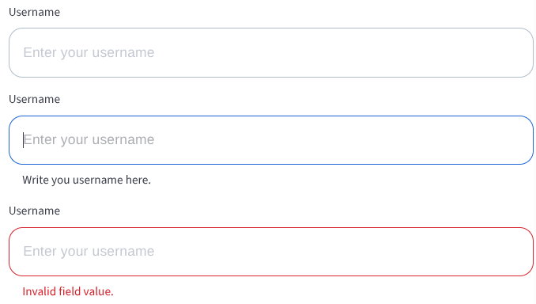

# BBBTextInput

The `BBBTextInput` component provides a styled, single-line text input field that supports icons, custom validation, and all standard input attributes.



## Usage Example

### Text Input with label and placeholder
```jsx
import { BBBTextInput } from 'bbb-ui-components-react';

<BBBTextInput label="Username" placeholder="Enter your username" />
```

### Text Input with label, placeholder and a helper text
```jsx
import { BBBTextInput } from 'bbb-ui-components-react';

<BBBTextInput label="Username" placeholder="Enter your username" helperText="Write here your username" />
```

### Text Input with label and placeholder and error state
```jsx
import { BBBTextInput } from 'bbb-ui-components-react';

<BBBTextInput error label="Username" placeholder="Enter your username" />
```

## Props

| Property      | Type                                              | Default | Description                                                              |
| ------------- | ------------------------------------------------- | ------- | ---------------------------------------------------------------------- |
| `label`       | `string`                                          |         | The label to be displayed above the input field.                       |
| `placeholder` | `string`                                          |         | The placeholder text to be displayed when the input is empty.          |
| `disabled`    | `boolean`                                         | `false` | If `true`, the input field will be disabled.                           |
| `inputRef`    | `React.Ref<HTMLInputElement>`                     |         | A ref to be forwarded to the underlying `input` element.               |
| `onChange`    | `(event: React.ChangeEvent<HTMLInputElement>) => void` |         | Callback fired when the value is changed.                              |
| `...props`    | `any`                                             |         | Any other props will be passed down to the underlying `input` element. |
