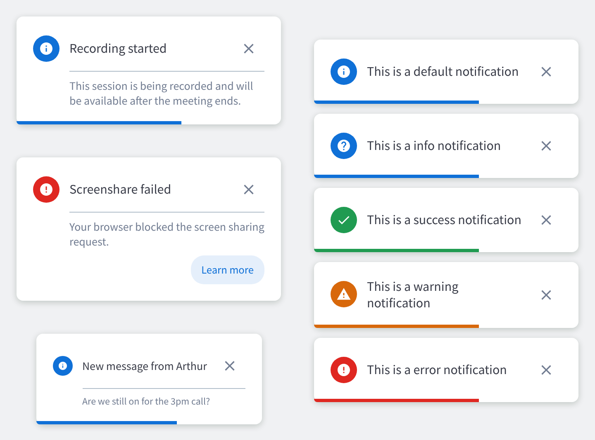

# BBBToast

The `BBBToast` component is the presentational card for transient notifications. It is laid out in two columns: the icon badge owns a full-height section on the left, and to its right sit the title (`message`, on a row it shares with the close button) and the `content` area for the description, links or action buttons.



`BBBToast` never hides itself. Both the close button and the `autoClose` timer call `onRequestClose`, and removing the card is up to whoever owns the toast stack. That keeps the card usable inside an external toast engine (such as `react-toastify`), which would otherwise be left rendering an empty slot.

## Usage Example

### Basic Toast

```jsx
import { BBBToast } from 'bbb-ui-components-react';

<BBBToast message="You are muted" />
```

### Toast With Content

Pass `content` for the description below the title. It shares the title's left edge, so the two read as one block. A divider separates them unless `showSeparator` is `false`.

```jsx
import { BBBToast } from 'bbb-ui-components-react';

<BBBToast
  variant="warning"
  message="Connection unstable"
  content="Your audio may be affected."
  showSeparator={false}
/>
```

### Dismissing the Toast

Wire `onRequestClose` to remove the card. It fires both when the close button is clicked and when `autoClose` elapses.

```jsx
import { useState } from 'react';
import { BBBToast } from 'bbb-ui-components-react';

const [visible, setVisible] = useState(true);

{visible && (
  <BBBToast
    message="Recording started"
    autoClose={5000}
    onRequestClose={() => setVisible(false)}
  />
)}
```

The countdown pauses while the pointer is over the card or focus is inside it, and resumes with the time that was left, so the toast never disappears under someone reading it or reaching for one of its buttons. A bar along the bottom of the card shows the time left and pauses with the countdown; pass `hideProgressBar` to drop it. Set `paused` to hold the countdown from outside as well, for example while the toast engine's stack is hovered.

Pass `autoClose={false}` for a toast that persists until it is dismissed manually, and `hideCloseButton` to drop the close button as well.

### Clickable Toast

`onClick` covers the whole card, and the cursor turns into a pointer to show it. Pass `disablePointer` to keep the default cursor anyway, or `disablePointer={false}` to show the pointer on a card without `onClick` — for example when the toast engine closes it on click.

```jsx
import { BBBToast } from 'bbb-ui-components-react';

<BBBToast
  small
  variant="info"
  message="New message in Public Chat"
  content="Click to open the chat panel."
  onClick={() => openChatPanel()}
/>
```

The card stays a live region, so the click is exposed through a real button wrapping `message`: screen readers announce it as a button named after the message, it is reachable with Tab and activates with Enter or Space, and its focus ring outlines the whole card. Pass `clickAriaLabel` when the message alone doesn't describe what the click does:

```jsx
<BBBToast
  message="New message in Public Chat"
  clickAriaLabel="Open Public Chat"
  onClick={() => openChatPanel()}
/>
```

Without a `message`, the button is visually hidden and takes its name from `clickAriaLabel`, falling back to the `content` text.

Clicks on interactive elements passed in `message` or `content` (links, buttons, inputs) stay with those elements and don't fire `onClick`.

### Toast With an Action

```jsx
import { BBBToast } from 'bbb-ui-components-react';

<BBBToast
  variant="error"
  message="Screenshare failed"
  content="Your browser blocked the screen sharing request."
  actionLabel="Learn more"
  onActionClick={() => window.open(helpLink)}
/>
```

### Rich Content

`content` takes an arbitrary node, so links, buttons and inline media all render. Use it when a notification needs more than one action — for example a confirmation toast with both a cancel and a confirm button, which `actionLabel` alone does not cover.

```jsx
import { BBBToast, BBButton } from 'bbb-ui-components-react';

<BBBToast
  icon={false}
  message="Start recording?"
  autoClose={false}
  showSeparator={false}
  content={(
    <>
      <p>Participants will be notified.</p>
      <BBButton label="Cancel" variant="secondary" size="sm" onClick={handleCancel} />
      <BBButton label="Start" variant="primary" size="sm" onClick={handleConfirm} />
    </>
  )}
/>
```

### Custom or Hidden Icon

Pass `icon` to replace the icon matched to `variant`, or `icon={false}` to drop the badge entirely.

```jsx
import { MdCampaign } from 'react-icons/md';
import { BBBToast } from 'bbb-ui-components-react';

<BBBToast message="Presenter changed" icon={<MdCampaign />} />
<BBBToast message="Start recording?" icon={false} />
```

## Props

| Property         | Type                                                        | Default     | Description                                                                                     |
| ---------------- | ----------------------------------------------------------- | ----------- | ----------------------------------------------------------------------------------------------- |
| `message`        | `React.ReactNode`                                           |             | The title of the notification, rendered on its own line. Optional — omit it for cards whose `content` carries the whole notification. Usually plain text; takes a node for inline i18n markup (e.g. a `<FormattedMessage>`). |
| `variant`        | `'default' \| 'info' \| 'success' \| 'warning' \| 'error'`  | `'default'` | Visual variant driving the default icon and the icon badge color.                                |
| `icon`           | `React.ReactNode \| false`                                  | icon matched to `variant` | A custom icon replacing the one matched to `variant`, or `false` to hide the icon badge entirely. |
| `content`        | `React.ReactNode`                                           |             | The description or secondary content (text, links, action buttons), rendered below the title and sharing its left edge. |
| `showSeparator`  | `boolean`                                                   | `true`      | Shows the divider between the title and `content`; only rendered when both are present.          |
| `small`          | `boolean`                                                   | `false`     | Compact variant for space-constrained placements.                                                |
| `disablePointer` | `boolean`                                                   | `!onClick`  | Keeps the default cursor instead of showing a pointer one, so the toast doesn't read as clickable; defaults to `false` when `onClick` is set and `true` otherwise. |
| `onClick`        | `React.MouseEventHandler<HTMLDivElement>`                   |             | A click handler for the whole toast (e.g. open a related chat or panel); exposed to assistive technology as a button wrapping `message`. |
| `clickAriaLabel` | `string`                                                    |             | The accessible name for the `onClick` action, overriding the `message` text; needed when `onClick` is set without a `message`, else the `content` text is used. |
| `actionLabel`    | `string`                                                    |             | The label for an optional action button rendered below the content.                              |
| `onActionClick`  | `React.MouseEventHandler<HTMLButtonElement>`                |             | A handler for the action button; only used when `actionLabel` is set.                            |
| `autoClose`      | `number \| false`                                           | `5000`      | The auto-dismiss delay in milliseconds, paused while the toast is hovered or focused, or `false` to persist until dismissed manually. |
| `paused`         | `boolean`                                                   | `false`     | Pauses the `autoClose` countdown from outside, on top of the card's own pause on hover and focus (e.g. while a toast engine's stack is hovered). |
| `hideProgressBar` | `boolean`                                                  | `false`     | Hides the bar at the bottom of the card that counts down `autoClose`; never shown when `autoClose` is `false`. |
| `hideCloseButton` | `boolean`                                                  | `false`     | Hides the close (X) button, for toasts that shouldn't be manually dismissed.                     |
| `closeButtonAriaLabel` | `string`                                              | `'Close'`   | The accessible name for the close button; pass a translated string in localized apps.            |
| `onRequestClose` | `() => void`                                                |             | A callback fired when the toast is dismissed, by the close button or by `autoClose`.             |
| `maxHeight`      | `string`                                                    | `'70vh'`    | Caps the card's height, scrolling its body past that point. Any CSS length.                      |
| `dataTest`       | `string`                                                    |             | The value for the `data-test` attribute on the container; also the base for the three derived ids below. |
| `messageDataTest` | `string`                                                   | `${dataTest}-message` | A test identifier applied to the message.                                              |
| `closeButtonDataTest` | `string`                                               | `${dataTest}-close-button` | A test identifier applied to the close button.                                    |
| `actionButtonDataTest` | `string`                                              | `${dataTest}-action-button` | A test identifier applied to the action button.                                  |
| `...props`       | `HTMLAttributes<HTMLDivElement>`                            |             | Any other props will be passed down to the underlying container div. They can override the live-region attributes (`role`, `aria-live`, `aria-atomic`), but not the card's own handlers or `data-test`. |

## Layout

The icon badge sits in a section that spans the card's full height, and the title and `content` share the column to its right, aligned to the same left edge. The close button shares a row with the title only, so it stays on the title's line instead of drifting down past the description.

When `icon` is `false` the icon section is not rendered at all, and the title and content take the whole card width.

In right-to-left documents the layout mirrors: the icon badge moves to the right and the close button to the left.

## Height and Scrolling

`maxHeight` caps the card and its body scrolls past that point, so tall content is never clipped without a scrollbar. This matters because toast engines cap their own containers — `react-toastify`'s is `max-height: 75vh; overflow: hidden` — and would otherwise cut the card off in silence.

The default of `70vh` sits just under that, so the card scrolls before the engine clips it. Lower it for a card that should stay small:

```jsx
<BBBToast message="Uploading presentations" maxHeight="20rem" content={rows} />
```

When only one region should scroll and the rest of the card should stay put, cap that region instead with `BBBScrollArea`, and raise `maxHeight` so the card itself is not the limit:

```jsx
import { BBBToast, BBBScrollArea } from 'bbb-ui-components-react';

<BBBToast
  message="Uploading presentations"
  content={<BBBScrollArea maxHeight="30vh">{fileRows}</BBBScrollArea>}
/>
```

## Cards Without a Title

`message` is optional. Omit it when the notification is a single line or a row that reads on its own — a file with its status, say — and `content` carries it:

```jsx
<BBBToast icon={false} content={<FileRow name="presentation.pdf" status="done" />} />
```

The title row is still rendered for the close button, which keeps its place at the end of the row; drop it too with `hideCloseButton` and the row goes away entirely.

## Test Identifiers

Set `dataTest` and the toast derives stable identifiers for its inner parts:

```jsx
<BBBToast dataTest="recordingToast" message="Recording started" actionLabel="Learn more" />
```

```html
<div data-test="recordingToast">
  <div data-test="recordingToast-message">Recording started</div>
  <button data-test="recordingToast-close-button">…</button>
  <button data-test="recordingToast-action-button">Learn more</button>
</div>
```

Override any of them individually when a selector has to keep an existing name:

```jsx
<BBBToast
  dataTest="notificationBanner"
  actionButtonDataTest="notificationBannerReloadButton"
  message="A new version is available"
  actionLabel={intl.formatMessage(intlMessages.reloadPage)}
  onActionClick={reload}
/>
```

Setting `dataTest` matters for more than convenience. With no value of its own, the underlying `BBButton` derives one from its label — and since `actionLabel` is usually a translated string, the resulting selector changes with the interface language. The derived ids above are what keep it stable.

`actionLabel` renders a button the toast owns, so arbitrary props cannot be forwarded to it; the identifiers above are the supported hook. When the action needs more than that — extra ARIA attributes, a different variant, or more than one button — render your own `BBButton` inside `content` instead, which is also how BBB builds its two-button confirmation toasts.

## Using It With a Toast Engine

`BBBToast` is the card, not the stack. Pair it with whatever engine positions, stacks and dismisses toasts — in `bigbluebutton-html5` that is `react-toastify`.

The engine wraps every toast in its own element, and `react-toastify`'s default wrapper styles a card of its own. Left alone, the two cards stack up: two backgrounds, two paddings, two shadows, mismatched corners and two close buttons. Turn the wrapper into a plain box and let `BBBToast` do the styling:

```css
.Toastify__toast.bbbToast {
  background: none;      /* the theme class paints #fff behind the card   */
  padding: 0;            /* wrapper adds 14px on top of the card's own    */
  border-radius: 0;      /* wrapper rounds to 6px, the card to 8px        */
  box-shadow: none;      /* wrapper adds its own 0 4px 12px shadow        */
  min-height: 0;         /* wrapper floors the height at 64px             */
  font-family: inherit;  /* wrapper forces sans-serif over the app font   */
}
```

```jsx
toast(
  <BBBToast message={message} onRequestClose={() => toast.dismiss(id)} />,
  { className: 'bbbToast', closeButton: false, toastId: id },
);
```

`closeButton: false` is what drops the engine's own X, since `BBBToast` already renders one. Keep the engine's `autoClose` and the card's `autoClose` from both running — pass the delay to whichever one owns dismissal and set the other to `false`. The card's own timer already pauses on hover and focus, so letting it own dismissal doesn't depend on the engine's `pauseOnHover`.

If the engine's wrapper is already a live region — `bigbluebutton-html5` wraps every toast in a `role="alert"` element — pass `role="none"` and `aria-live="off"` to the card so the notification isn't announced twice.

`react-toastify`'s container defaults to a 320px width, which is the width the Storybook stories render at (`20rem`).

## Accessibility

The card renders as a live region so screen readers announce it as it appears: `role="status"` with `aria-live="polite"` for the `default`, `info` and `success` variants, and `role="alert"` with `aria-live="assertive"` for `warning` and `error`.

These live-region attributes can be overridden through the rest props, for when the surrounding toast engine already provides the live region (see [Using It With a Toast Engine](#using-it-with-a-toast-engine)).

With `onClick`, the click is exposed as a real button wrapping `message` (or a visually hidden one named by `clickAriaLabel` when there is no message), so it is announced as a button, reachable with Tab and activated with Enter or Space. See [Clickable Toast](#clickable-toast).

The `autoClose` countdown pauses while the card is hovered or has focus inside it, so it never disappears under someone reading it or reaching for one of its buttons.

The close button's accessible name defaults to the English `'Close'`; pass `closeButtonAriaLabel` with a translated string in localized apps.

Every icon glyph is white, and each badge fill keeps at least the 3:1 non-text contrast ratio against it, which is why `success` and `warning` use the darker shades of their colors (`--color-success-dark`, `--color-warning-dark`).
