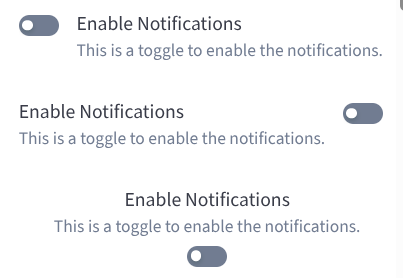

# BBBToggle

The `BBBToggle` component provides a flexible toggle switch that can be used for binary state changes. It supports labels (`label` and `helperText`) and various textPosition configurations.



## Usage Example

### Toggle with label
```jsx
import { BBBToggle } from 'bbb-ui-components-react';

<BBBToggle label="Enable Notifications" />
```

### Toggle with label and helper text
```jsx
import { BBBToggle } from 'bbb-ui-components-react';

<BBBToggle label="Enable Notifications" helperText="This is a toggle to enable the notifications." />
```

### Toggle with label and helper text on the left
```jsx
import { BBBToggle } from 'bbb-ui-components-react';

<BBBToggle label="Enable Notifications" helperText="This is a toggle to enable the notifications." textPosition="left" />
```

### Toggle with label and helper text on the top
```jsx
import { BBBToggle } from 'bbb-ui-components-react';

<BBBToggle label="Enable Notifications" helperText="This is a toggle to enable the notifications." textPosition="top" />
```

## Props

| Property       | Type                                                                | Default   | Description                                                                    |
| -------------- | ------------------------------------------------------------------- | --------- | ------------------------------------------------------------------------------ |
| `label`        | `string`                                                            |           | The main label text displayed next to the toggle.                              |
| `helperText`   | `string`                                                            |           | The helper text displayed below the label.                                     |
| `textPosition`      | `keyof typeof TEXT_POSITIONS`                                       | `'right'` | The position of the text labels relative to the toggle switch.                 |
| `disabled`          | `boolean`                                                           | `false`   | If `true`, the toggle will be disabled and unresponsive.                       |
| `onChange`          | `(event: React.ChangeEvent<HTMLInputElement>, checked: boolean) => void` |           | Callback function that is fired when the toggle state changes.                 |
| `aria-label`        | `string`                                                            |           | The accessible name for the toggle.                                            |
| `aria-labelledby`   | `string`                                                            |           | The ID of the element that labels the toggle.                                  |
| `aria-describedby`  | `string`                                                            |           | The ID of the element that describes the toggle.                               |
| `...toggleProps`    | `any`                                                               |           | Any other props will be passed down to the underlying Material-UI Switch component. |
