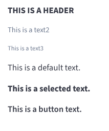

# Typography Component

The `BBBTypography` component is used to display text with different styles and semantic elements.



## Usage

```jsx
import { BBBTypography } from 'bbb-ui-components-react';

<BBBTypography variant="header">This is a header</BBBTypography>
<BBBTypography variant="default">This is a default text.</BBBTypography>
<BBBTypography variant="selected">This is a selected text.</BBBTypography>
<BBBTypography variant="button" as="span">This is a button text.</BBBTypography>
```

## Props

| Prop      | Type                                                               | Default   | Description                                                     |
| --------- | ------------------------------------------------------------------ | --------- | --------------------------------------------------------------- |
| `variant` | `default` \| `selected` \| `text2` \| `text3` \| `header` \| `button` | `default` | Defines the style of the text.                                  |
| `as`      | `React.ElementType`                                                | `p`       | Defines the HTML element to be rendered.                        |
| `children`| `React.ReactNode`                                                  | -         | The content of the component.                                   |
